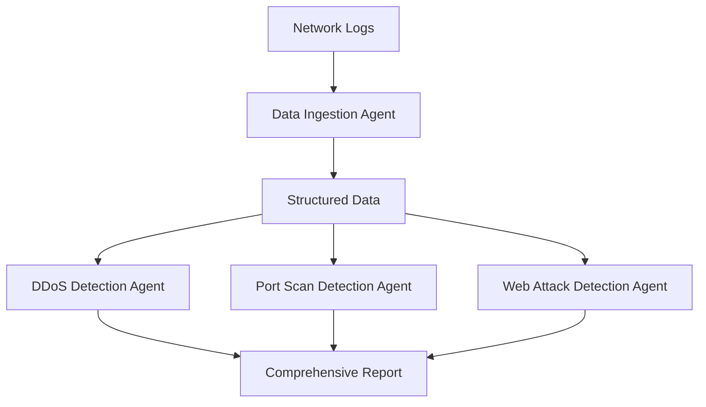

# CyberGuard: Multi-Agent LLM Framework for Intelligent Network Security Analysis


## 🚀 Project Overview

CyberGuard is an innovative network security analysis framework that leverages the power of Large Language Models (LLMs) through a sophisticated multi-agent system. Developed as part of the Cerebras AI Fellowship program, this project demonstrates the potential of applying advanced AI techniques to cybersecurity challenges.

### 🎯 Key Features

- **Multi-Agent Architecture**: Specialized agents for different types of attack detection
- **Real-Time Analysis**: Process and analyze network logs in real-time
- **Intelligent Threat Detection**: 
  - DDoS Attack Detection
  - Port Scanning Recognition
  - Web Attack Identification
- **Structured Reporting**: Comprehensive threat analysis with detailed insights
- **Scalable Design**: Built to handle enterprise-level network logs

## 📋 Prerequisites

- Python 3.8 or higher
- Cerebras API access
- Network logs in CSV format

## 🛠️ Installation

1. Clone the repository:
```bash
git clone https://github.com/Hannan2004/Cerebras-AI-Fellowship.git
cd Cerebras-AI-Fellowship
```

2. Install required packages:
```bash
pip install -r requirements.txt
```

3. Set up your Cerebras API key:
```bash
export CEREBRAS_API_KEY='your-api-key'
```

## 📊 Usage

1. Prepare your network logs in CSV format with the following columns:
   - timestamp
   - source_ip
   - destination_ip
   - port
   - protocol
   - payload_size

2. Run the analysis:
```python
from cyberguard import SecurityAnalysisPipeline

# Initialize the pipeline
pipeline = SecurityAnalysisPipeline()

# Analyze logs
results = pipeline.analyze_logs('path/to/your/logs.csv')

# View results
print(results.summary())
```

## 🏗️ Architecture



## 📈 Example Output

```json
{
    "analysis_summary": {
        "ddos_threats": [
            {
                "source_ip": "192.168.1.100",
                "confidence": 0.95,
                "pattern": "SYN flood"
            }
        ],
        "port_scans": [
            {
                "source_ip": "10.0.0.5",
                "targeted_ports": "20-80",
                "scan_type": "TCP SYN"
            }
        ],
        "web_attacks": [
            {
                "type": "SQL Injection",
                "source_ip": "172.16.0.100",
                "target_endpoint": "/api/users"
            }
        ]
    }
}
```

## 🔬 Technical Details

- **Framework**: LangChain for orchestrating LLM interactions
- **Model**: Cerebras LLaMA 3.1 70B
- **Processing Pipeline**: Asynchronous processing for real-time analysis
- **Output Format**: Structured JSON with threat classifications
